# 工程日志
## 项目
1、数据集采集

2、模型选择

3、模型训练

## 文件说明
/Data 储存爬取的数据集

/data_get 数据集爬取

  _/Try_Get_More.ipynb 二次数据爬取

/model_train 训练模型

/study 学习他人的文件

## 尝试记录
### 对于数据集data_training_20240213

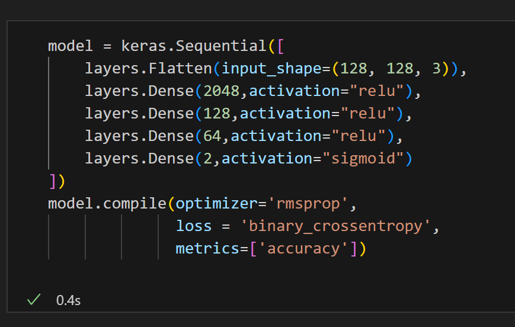
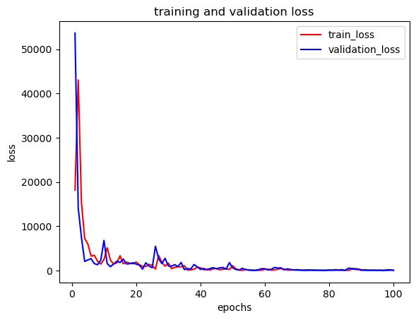
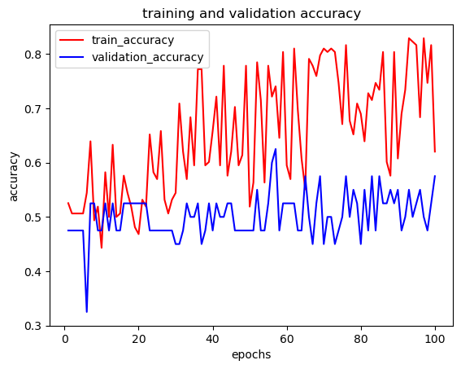

### 对于数据集data_training_20240214

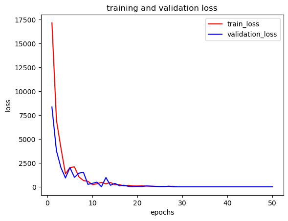
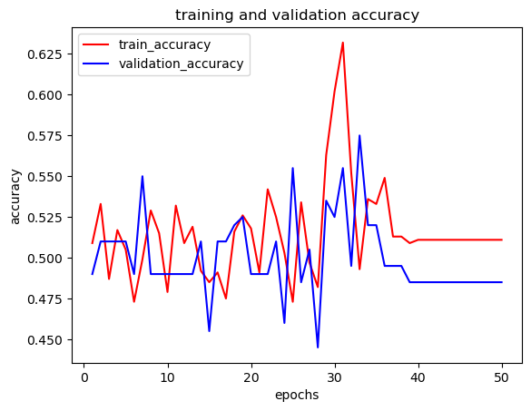

### 对于数据集data_training_20240217
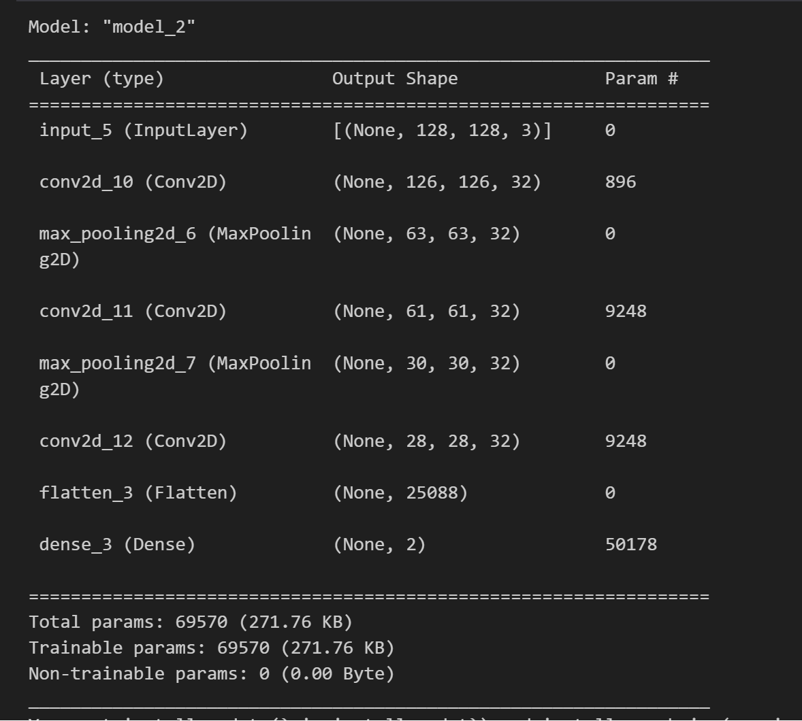
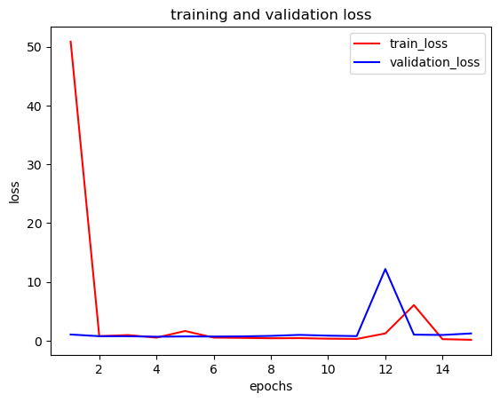
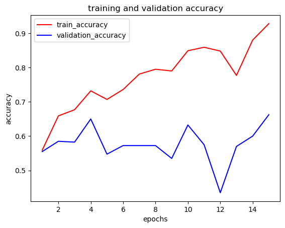
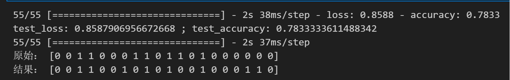

### 对于数据集data_training_20240217

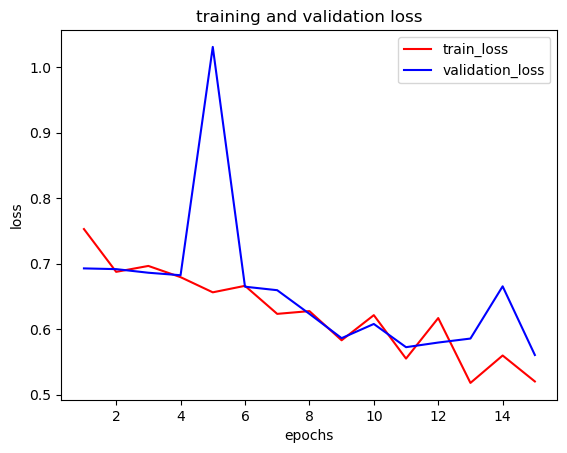
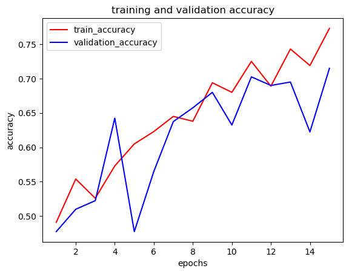
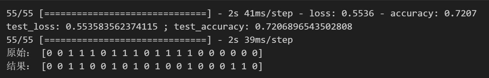

### 对于数据集data_training_20240217
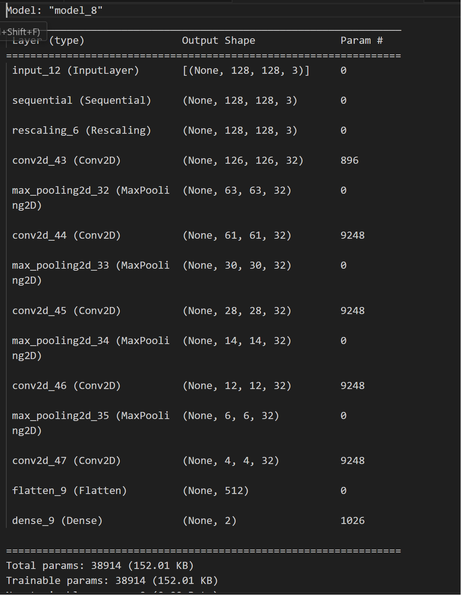
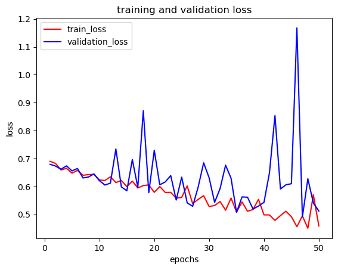
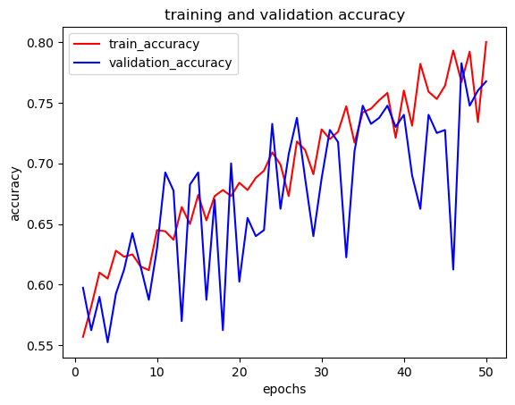
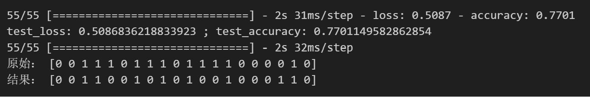

### 对于数据集data_training_20240217
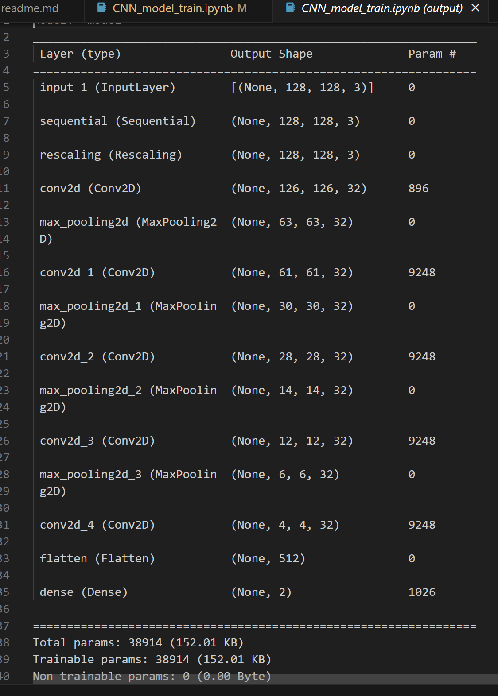
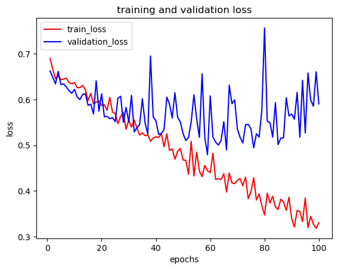
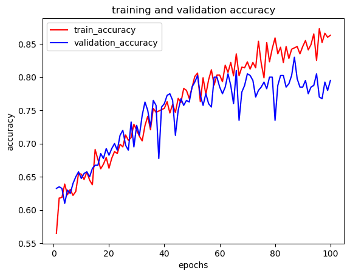
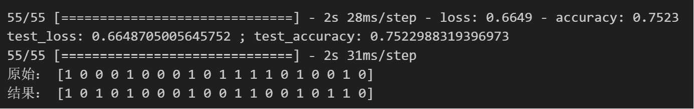

### 对于数据集data_training_20240217

## 每日记录
2024 01 13 陈佳天 李杰瑞

- 10：30-11：00 完成课题申报意向表

- 11：11
  - 问题：如何同步代码?
  - 解决方法：学习使用Github和vsc同步  12：04但是失败了
- 12：05于是，我们使用了U盘复制这一高效的方法
- 13：18我们成功爬取了一些表情包（26张），并做到了只爬取jpg
- 13：22 data_get.ipynb为对于'https://www.doutub.com/'的爬取
        data_get2.ipynb 为对于'https://qq.yh31.com/zjbq/'的爬取（学习自csdn）
		data_get3.ipynb 为对于'https://www.dbbqb.com/'的爬取，但好像遇到了阻力（可能这个网站有反爬机制）
- 14：06 经过对data_get2.ipynb的改进对网页进行了多页爬取，暂未成功，可以爬几页
- 13：15 改进为data_get2_2.ipynb 分页进行爬取
- 15：36 爬取258张（257）

2024 01 17 
- 13 :04 决定以CNN作为深度学习的模型，并开始相应的模型原理学习
- 16：44初步完成了CNN的第一部分测试，建造了3units conv + max pooling的简单模型，打下了理论基础。作用是  ljr熟练了基于tensoflow的CNN编写  。 
- 16：44 更新爬取方式（未进行什么内容）

2024 01 22
- 14:43 整理文件
- 15:48 将尝试写在了/Keras_first_try中
- 16:13 在导入图片时失败
- 16:25 发现jpg如果为动图则无法导入
- 17:37 无法储存，开摆

2024 01 24
- 20:34 开始赶进度
- 20:42 解决无法储存问题
- 21:07 数据集单个过大，无法训练模型
- 21:26 发现好像不是数据集问题，而是穿入形式不对
- 21:56 依然没有解决
- 22:12 依然没有解决，放弃

2024 01 25
- 17:10 继续尝试
- 17:17 发现好像要把每一个数据改为相同大小
- 17:51 成功训练
- 18:05 发现由于数据不成比例，所以训练结果为全部判断为非攻击性

2024 01 26
- 20:10 为了解决数据不成比例的问题，随机上网爬取新的数据
- 21:00 遇到了问题并为此耗费40分钟，python报错是“url不正确”，此问题有待解决

2024 02 01
- 13:57 同步李杰瑞代码
- 15:47 完成爬取编写
- 17:19 爬了5页，共665张

2024 02 02
- 20:28 一边看亚洲杯，一边爬一会儿

2024 02 03
- 10:41 爬了一晚上，电脑没电了，从头爬
- 12:52 爬完了807

2024 02 05
- 17:48 修改图片
- 18:30 处理gif：https://blog.csdn.net/qq_53521409/article/details/127484277?ops_request_misc=%257B%2522request%255Fid%2522%253A%2522170712791516800227469681%2522%252C%2522scm%2522%253A%252220140713.130102334..%2522%257D&request_id=170712791516800227469681&biz_id=0&utm_medium=distribute.pc_search_result.none-task-blog-2~all~baidu_landing_v2~default-6-127484277-null-null.142^v99^pc_search_result_base8&utm_term=python%20%E8%AF%BB%E5%8F%96gif&spm=1018.2226.3001.4187
- 19:10 成功处理完并全部保留807张
- 19:03 开始考虑重新爬，保留gif
- 19:57 保留gif程序完成，后续爬取等有完整时间

2024 02 06
- 10:22 开始完整爬取
- 13:44 补充结尾提示音
- 14:59 完成10474张爬取，疑似出现问题

2024 02 07
- 14:36 数据集预处理
- 14:58 完成去动图预处理
- 15:09 完成统一大小预处理
- 15:12 开始手动分类

2024 02 11
- 22:28 分类5000张

2024 02 12
- 14:04 分类完成10468张

2024 02 13
- 14:11 备份数据集
- 14:57 开始编写代码，认为空白表情有干扰
- 15:16 筛除干扰项
- 15:48 将标签数据进行one-hot编码，并调整最后层宽度，成功输出
- 16:13 成功训练，效果不佳
- 16:28 计划一比一爬取表情包
- 17:21 爬取229张侮辱性
- 18:40 数据集预处理
- 19:14 成功正常训练模型
- 19:20 略微调整参数

2024 02 14
- 14:34 计划增加精度绘制
- 15:01 调整输入
- 19:34 又爬了1260张侮辱性
- 19:54 完成预处理
- 20:12 训练模型，效果不佳，认为是数据集原因

2024 02 15
- 16:16 略调整模型
- 18:34 经过阅读学习，发现由于处理图像，所以应该使用卷积神经网络，之前模型错误

2024 02 17
- 09:07 训练CNN模型，取得进步，无法泛化
- 09:45 使用数据增强，效果不佳
- 10:08 成功泛化，发现epoch不够大，但准确率不高

2024 03 02

- 20:11 尝试保存训练模型，并使用热力图（CAM）
- 21:43 出现热力图，但效果不好说
- 21:57 成功显示，发现模型很抽象

2024 03 16

- 21:27 调整模型（发现要尽量缩小），正确率达80%